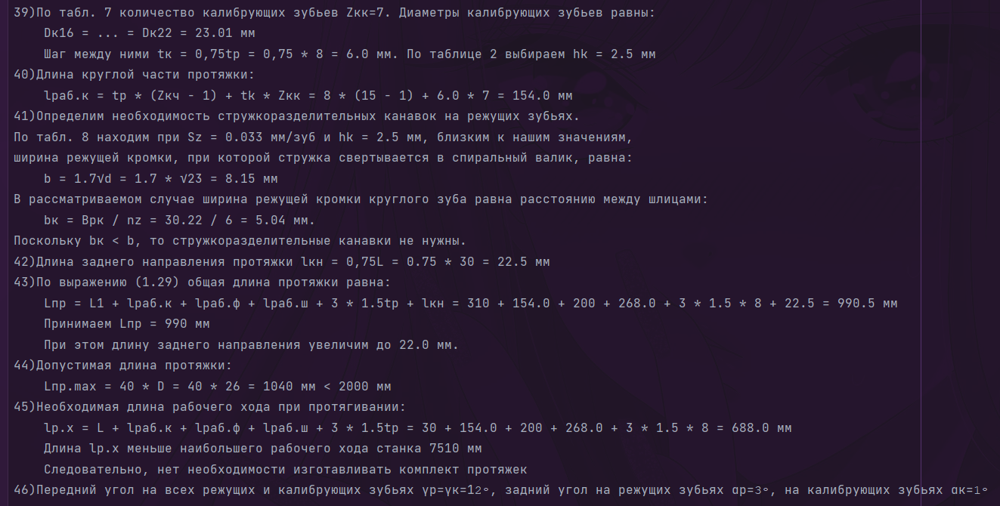
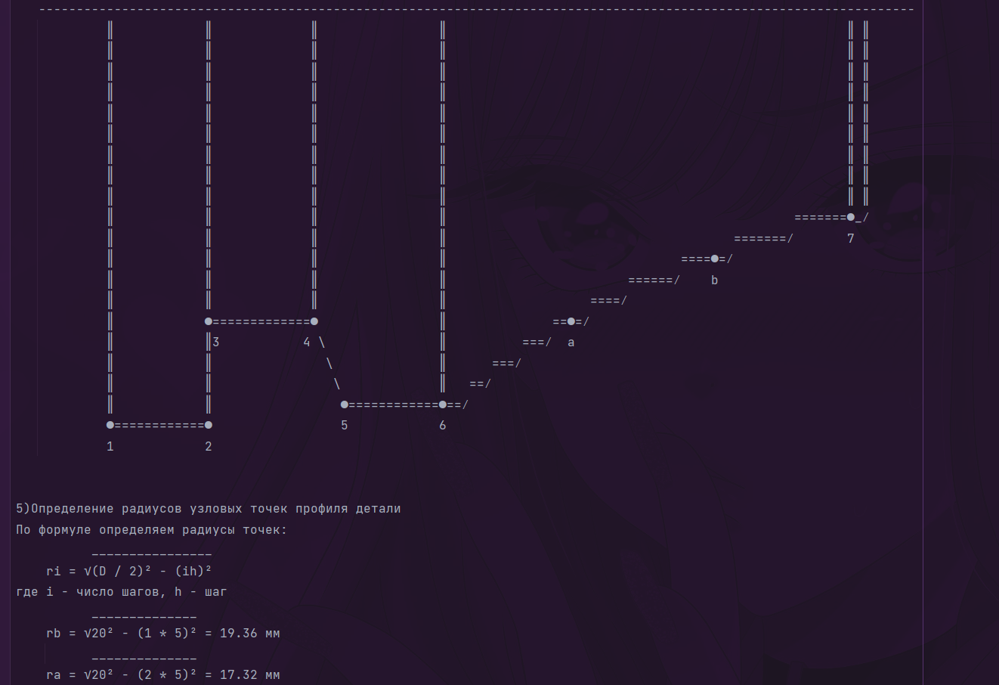
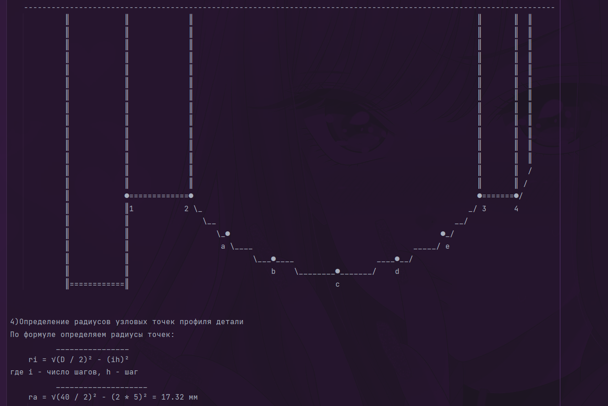

# CourseWorkCalculator

---

## Содержание

1. [Разработчики](#разработчики)
2. [Ссылки](#ссылки)
3. [Особенности](#особенности)
4. [Как бот выглядит?](#как бот выглядит?)
5. [Решенная курсовая работа](#решенная курсовая работа)

---

### Разработчики
- [Куликов Дмитрий](https://github.com/GadzZzilo) (BotEngine)
- [Губайдуллин Нурислам](https://github.com/tonitaga) (CourseWorkEngine)

---

### Ссылки

- Нажми [сюда](https://t.me/CalculatorlevlevBot), чтобы перейти к боту

---

### Особенности

- Интегрирована оплата с помощью библиотеки "yoomoney-api"
- Используется машина состояний(FSM)
- С использованием фильтров в middleware включена анти-флуд система

---

### Как бот выглядит?
<ul>
<li>

<b>Команды бота</b>

</li>

<li>

<b>Вы выбираете необходимую услугу, бот проверяет данные и ожидает оплаты перед расчетами</b>

</li>
</ul>

---

### Решенная курсовая работа

После оплаты бот отправляет текстовый файл следующего содержания:

- **Файл с решением для протяжки**

- **Файл с решением круглого резца**

- **Файл с решением призматического резца**

